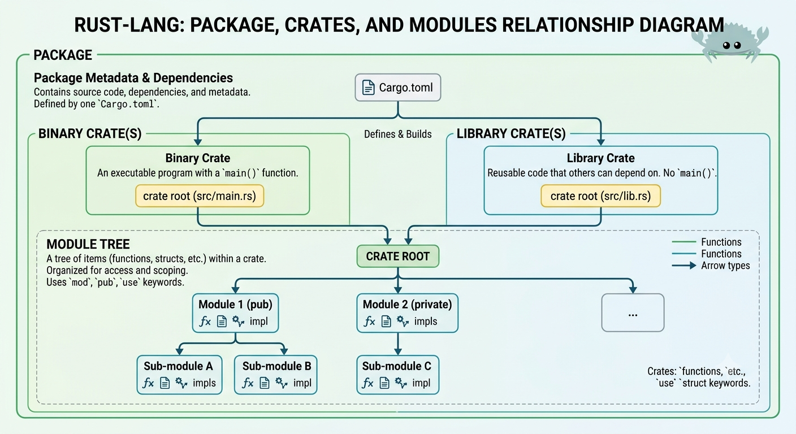

# rust notes


[rustup](https://rustup.rs/) is an installer for the systems programming language Rust.
It is an official Rust project.

## reading 

Interactive learning: https://rust-book.cs.brown.edu/

Terminology
* *prelude*
  * By default, Rust has a set of items defined in the standard library that it brings into the scope of every program. This set is called the prelude.
  * If a type you want to use isn’t in the prelude, you have to bring that type into scope explicitly with a use statement.
* *associated function*
  * a function that's implemented on a type
  * example: `String::new()`
    * `::` indicates `new` is an associated function of the `String` type
* *enumeration*, *enum*, *variant*
  * *enumeration*, aka *enum*, is a type that can be in one of multiple possible states
  * each possible state is called a *variant*
  * `Result`'s variants are `Ok` and `Err`
* *crate*
  * a crate is a collection of Rust source code files
  * binary crate: an executable
  * library crate: contains code that is intended to be used in other programs and can't be executed on its own
  * You won’t just know which traits to use and which methods and functions to call from a crate, so each crate has documentation
  * a *crate* is the smallest amount of code that the Rust compiler considers at a time
  * *crate root*
    * A *crate root* is a source file that the Rust compiler starts from and makes up the root module of your crate
* *package*
  * a *package* is a bundle of one or more crates that provides a set of functionality
  * a *package* contains a `Cargo.toml` file that describes how to build those crates.
  * Several rules determine what a package can contain.
    * A package must contain zero or one library crates, and no more.
    * It can contain as many binary crates as you’d like, but
    * it must contain at least one crate (either library or binary).
  * 
* *module*
  * code within a module is private by default
  * We define a module with the `mod` keyword followed by the name of the module
  * Inside modules, we can place other modules
  * Modules can also hold definitions for other items, such as structs, enums, constants, traits, and functions
  * *paths* for referring to an item in the module tree
    * an *absolute path* is the full path starting from a crate root
      * for code from an external crate, the absolute path begins with the crate name
      * for code from the current crate, it starts with th eliteral `crate`
    * a *relative path* starts from the current module and uses `self`, `super`, or an identifier in the current module
  * In Rust, all items (functions, methods, structs, enums, modules, and constants) are private to parent modules by default.
  * Items in a parent module can’t use the private items inside child modules, but items in child modules can use the items in their ancestor modules.
  * if X isn’t public but Y function is defined in the same module as X (that is, Y and X are siblings), we can refer to X from Y
  * If we use `pub` before a struct definition, we make the struct public, but the struct’s fields will still be private
  * if we make an enum public, all of its variants are then public
  * you only need to load a file using a `mod` declaration *once* in your module tree
    * Once the compiler knows the file is part of the project, other files in your project should refer to the loaded file’s code using a path to where it was declared
    * `mod` is not an “include” operation that you may have seen in other programming languages
  * convention
    * Bringing the function’s parent module into scope with `use`
    * when bringing in structs, enums, and other items with use, it’s idiomatic to specify the full path
  * *re-exporting*
    * To enable code outside that scope to refer to that name as if it had been defined in that scope, we can combine `pub` and `use`
  * the standard `std` library
    * the standard `std` library is also a crate that’s external to our package
    * Because the standard library is shipped with the Rust language, we don’t need to change Cargo.toml to include `std`
    * we do need to refer to it with `use` to bring items from there into our package’s scope. e.g., `use std::collections::HashMap;`
  * glob operator
    *  we want to bring all public items defined in a path into scope, we can specify that path followed by the `*` glob operator. e.g., `use std::collections::*;`

* *Semantic Versioning*, *SemVer*
  * a standard for writing version numbers
  * https://semver.org/
* *shadow*
  * *shadowing* lets us reuse a variable name
  * often used when converting a value from one type to another
  * we can perform a few transformations on a value but have the variable be immutable after those transformations have completed
      ```
      let x = 3;
      let x = x + 2;
      ```
* *scalar* type
  * represents a single value
  * Rust has 4 primary scalar types:
    * integers
      * `i8`, `i16`, `i32`, `i64`, `i128`, `isize`
      * `u8`, `u16`, `u32`, `u64`, `u128`, `usize`
      * integer types default to `i32`
      * the primary situation in which you'd use `isize` or `usize` is when indexing some sort of collection
      * examples: `98_222`, `0xff`, `0o77`, `0b1111_0000`, `b'A'`, `57u8`
    * floating-point numbers
      * `f32`, `f64`
      * default type if `f64`
    * Booleans
      * `bool`
      * one byte in size
    * characters
      * `char`
      * specify `char` literals with single quotation marks, as opposed to string literals, which use double quotation marks
      * 4 bytes in size and represents a Unicode scalar value
* *compound* type
  * *tuples*
    * fixed length: once declared, they cannot grow or shrink in size
    * To get the individual values out of a tuple, we can use pattern matching to destructure a tuple value. See *destructuring* below
    * can also access a tuple element using a period (`.`) followed by the index of the value
    * tuple without any values has a special name, *unit*
      * this value and its corresponding type are both written `()` and represent an empty value or an empty return type
      * expressions implicitly return the unit value if they don't return any other value
    * we can modify individual elements of a mutable tuple
  * *arrays*
    * every element of an array must have the same type
    * arrays in Rust have a fixed length
    * Arrays are useful when
      * you want your data allocated on the stack, the same as the other types we have seen so far, rather than the heap
      * or when you want to ensure that you always have a fixed number of elements
    * an array is a single chunk of memory of a known, fixed size that can be allocated on the stack
    * out of bound check
      * When you attempt to access an element using indexing, Rust will check that the index you’ve specified is less than the array length.
      * If the index is greater than or equal to the length, Rust will panic.
      * This check has to happen at runtime.
    * examples:
      * `let a = [1, 2, 3, 4, 5];`
      * `let a: [i32; 5] = [1, 2, 3, 4, 5];`
        * `i32` is the type of each element; the number `5` indicates the array contains five elements
      * `let a = [3; 5];`
        * `5` elements that will all be set to the value `3` initially
* *destructuring*
  * ```
    let tup = (500, 6.4, 1);
    let (x, y, z) = tup; // use a pattern with let to take tup and turn it into three separate variables
    ```
* *statements* vs *expressions*
  * Statements are instructions that perform some action and do not return a value.
    * `let y = 6;` is a statement.
  * Expressions evaluate to a resultant value.
    * calling a macro is an expression
    * `if` is an expression
    * a new scope block created with curly brackets is an expression
      * ```
        {
          let x = 3;
          x + 1
        }
        ```
  * Expressions do not include ending semicolons. If you add a semicolon to the end of an expression, you turn it into a statement, and it will then not return a value
* *arms* (in `if` expressions)
  * Blocks of code associated with the conditions in if expressions are sometimes called arms
* loop labels
  * you can optionally specify a loop label on a loop that you can then use with `break` or `continue` to specify that those keywords apply to th elabeled loop instead of the innermost loop
* *frames*
  * Variables live in frames.
  * A frame is a mapping from variables to values within a single scope, such as a function.
  * Frames are organized into a stack of currently-called-functions.
  * After a function returns, Rust deallocates the function’s frame. (Deallocation is also called *freeing* or *dropping*.)
* *Box*
  * Rust provides a construct called Box for putting data on the heap.
  * example: `let a = Box::new([0; 1000000]);`
  * Box deallocation principle: If a variable owns a box, when Rust deallocates the variable’s frame, then Rust deallocates the box’s heap memory.
  * Moved heap data principle: if a variable x moves ownership of heap data to another variable y, then x cannot be used after the move.
* *slice*
  * Slices let you reference a contiguous sequence of elements in a *collection*
  * A string slice is a reference to part of a String
    * String Literals Are Slices
* *struct*
  * *fields* -- names and types of the pieces of data
  * when creating an *instance*, We don’t have to specify the fields in the same order in which we declared them in the struct
  * Rust doesn’t allow us to mark only certain fields as mutable
  * *field init shorthand* -- when parameter names and the struct field names are exactly the same
    * ```
      User {
        active: true,
        username,  // field init shorthand
        email,     // field init shorthand
        sign_in_count: 1,
      }
      ```
  * *struct update syntax*
    * ```
      let user2 = User {
        email: String::from("another@example.com"),
        ..user1
      }
      ```
      * it moves the data
      * after creating `user2`, `user1` is partially invalidated because the String in the username field of `user1` was moved into `user2`
      * If we had given `user2` new String values for both email and username, and thus only used the active and sign_in_count values from `user1`, then `user1` would still be fully valid after creating `user2`.
  * Rust’s borrow checker will track ownership permissions at both the struct-level and field-level
  * ```
    #[derive(Debug)]
    struct Rectangle {
        width: u32,
        height: u32,
    }
    ```
    * `{:?}`
      * ```
        Rectangle { width: 30, height: 50 }
        ```
    * `{:#?}`
      * ```
        Rectangle {
            width: 30,
            height: 50,
        }
        ```
  * `&self` is actually short for `self: &Self`
    * Within an `impl` block, the type `Self` is an alias for the type that the `impl` block is for
  * Note that we can choose to give a method the same name as one of the struct’s fields
  * *associated functions*
    * All functions defined within an impl block are called *associated functions*
  * `new` isn’t a special name and isn’t built into the language
  * Each struct is allowed to have multiple `impl` blocks
  * Method Calls are Syntactic Sugar for Function Calls
  * Rust does not have an equivalent to the arrow `operator ->` like C++
    * Rust will automatically reference and dereference the method receiver when you use the dot operator
    * Rust will insert as many references and dereferences as needed to make the types match up for the self parameter
  * remember: when you see an error like “cannot move out of *self”, that’s usually because you’re trying to call a self method on a reference like `&self` or `&mut self`
    * Rust is protecting you from a double-free.
* *tuple structs*
  * give the whole tuple a name
  * make the tuple a different type from other tuples
  * naming each field as in a regular struct would be verbose or redundant
  * examples:
    * `struct Color(i32, i32, i32);`
    * `struct Point(i32, i32, i32);`
* *unit-like struct*
  * example
    * ```
      struct AlwaysEqual;
      ...
      let subject = AlwaysEqual;
      ```
* *enum*
  * The name of each enum variant that we define also becomes a function that constructs an instance of the enum.
  * you can put any kind of data inside an enum variant: strings, numeric types, or structs. You can even include another enum!
  * example
    * ```
      enum Message {
          Quit,
          Move { x: i32, y: i32 },
          Write(String),
          ChangeColor(i32, i32, i32),
      }
      ```
  * Just as we’re able to define methods on structs using impl, we’re also able to define methods on enums

`rustup`:
* update to a newly released version
  * `rustup update`
* uninstall Rust and `rustup`
  * `rustup self uninstall`
* open the local doc in browser
  * `rustup doc`

> Rust style is to indent with four spaces

> using a ! means that you’re calling a macro instead of a normal function

> Cargo is Rust’s build system and package manager.

> Programming language design is often thought of in terms of which features you include, but the features you exclude are important too

> The `Option<T>` enum is so useful that it’s even included in the prelude ... Its variants are also included in the prelude: You can use `Some` and `None` directly without the `Option::` prefix

> In Rust, packages of code are referred to as crates.

cargo:
* create a project
  * `cargo new`
  * `cargo new --lib`
* build a project
  * `cargo build`
* build and run a project
  * `cargo run`
* build a project without producing a binary
  * `cargo check`
* build with optimizations
  * `cargo release`
* build documentation provided by all dependencies locally and open it in browser
  * `cargo doc --open`

*Cargo.lock* file
* created on the first run of `cargo build`
* following builds will use versions from Cargo.lock file
* often checked into source control because it's important for reproducible builds
* `cargo update` will ignore the Cargo.lock file and figure out all the latest versions that fit the specifications in Cargo.toml

pattern matching
  * a `match` expression is made up of `arms`
  * an `arm` consits of a `pattern` to match against, and the code that should be run if the value given to match fits that arm's pattern
  * Rust takes the value given to match and looks through each arm’s pattern in turn
  * the match expression ends after the first successful match
  * The code associated with each arm is an expression
  * the resultant value of the expression in the matching arm is the value that gets returned for the entire match expression.
  * `_` is a special pattern that matches any value and does not bind to that value
  * you can think of `if let` as syntax sugar for a match that runs code when the value matches one pattern and then ignores all other values

*immutable variables* vs *constants*
* `mut` is not allowed to be used with constants
* the type of constants must be annotated
* constants can be declared in any scope, including the global scope
* constants may be set only to a constant expression, not the result of a value that could only be computed at runtime
* Rust’s naming convention for constants is to use all uppercase with underscores between words
* Constants arer valid for the entire time a program runs, within the scope in which they were declared

functions
* Rust code uses snake case as the conventional style for function and variable names
* Rust doesn’t care where you define your functions, only that they’re defined somewhere in a scope that can be seen by the caller
  * callee can be defined after the caller
* *parameters* vs *arguments*
  * *parameters* are special variables that are part of a function's signature
  * *arguments* are concrete values for those parameters
* function bodies are made up of a series of statements optionally ending in an expression
* function definitions are statements; calling a function is an expression, not a statement

> Rust is an expression-based language

> Rust has three kinds of loops: `loop`, `while`, and `for`.

> Rust compiler treats a `break` expression and a `return` expression as having the value unit, or `()`.

> Even in situations in which you want to run some code a certain number of times, most Rustaceans would use a for loop. The way to do that would be to use a Range

> A foundational goal of Rust is to ensure that your programs never have undefined behavior. That is the meaning of “safety.”

> A secondary goal of Rust is to prevent undefined behavior at compile-time instead of run-time.

> Rust Does Not Permit Manual Memory Management

> References are non-owning pointers

> *Pointer Safety Principle*: data should never be aliased and mutated at the same time.

ownership, borrow checker
* The core idea behind the borrow checker is that variables have three kinds of permissions on their data:
  * **Read**(**R**): data can be copied to another location
  * **Write**(**W**): data can be mutated
  * **Own**(**O**): data can be moved or dropped
* By default, a variable has read/own permissions (**RO**) on its data. If a variable is annotated with let mut, then it also has the write permission (**W**).
  * The key idea is that **references can temporarily remove these permissions**.
* permissions are defined on **places** and not just variables
  * a place is anything you can put on the left-hand side of an assignment
    * e.g., `a`, `*a`, `a[0]`, `a.0`, `a.field`, `*((*a)[0].1)`
* Permissions Are Returned At The End of a Reference’s Lifetime
* data must outlive any references to it
* These permissions don’t exist at runtime, only within the compiler.
* functions should not mutate their inputs if the caller would not expect it
* it is very rare for rust functions to take ownership of heap-owning data structures like `Vec` and `String`
* In general, writing Rust functions is a careful balance of asking for the *right* level of permissions
* Rust doesn’t look at the implementation of `get_first` when deciding what `get_first(&name)` should borrow. Rust only looks at the type signature, which just says “some String in the input gets borrowed”.

> standard library types are often not much more complicated than what you might come up with.

> Modules aren’t useful only for organizing your code. They also define Rust’s *privacy boundary*: the line that encapsulates the implementation details external code isn’t allowed to know about, call, or rely on. So, if you want to make an item like a function or struct private, you put it in a module.
>
> The way privacy works in Rust is that all items (functions, methods, structs, enums, modules, and constants) are private by default.
> * Items in a parent module can’t use the private items inside child modules, but
> * items in child modules can use the items in their ancestor modules.

`pub`: `struct` vs `enum`

> If we use `pub` before a struct definition, we make the struct public, but the struct’s fields will still be private. We can make each field public or not on a case-by-case basis.
>
> In contrast, if we make an enum public, all of its variants are then public.
>
> * Enums aren’t very useful unless their variants are public; it would be annoying to have to annotate all enum variants with `pub` in every case, so the default for enum variants is to be public.
> * Structs are often useful without their fields being public, so struct fields follow the general rule of everything being private by default unless annotated with `pub`.

`use`: function vs `struct`/`enum`

> Bringing the function’s parent module into scope with use so we have to specify the parent module when calling the function makes it clear that the function isn’t locally defined while still minimizing repetition of the full path.
>
> On the other hand, when bringing in structs, enums, and other items with `use`, it’s idiomatic to specify the full path.
>
> There’s no strong reason behind this idiom: it’s just the convention that has emerged, and folks have gotten used to reading and writing Rust code this way.

`pub use`

> Re-exporting is useful when the internal structure of your code is different from how programmers calling your code would think about the domain. For example, in this restaurant metaphor, the people running the restaurant think about “front of house” and “back of house.” But customers visiting a restaurant probably won’t think about the parts of the restaurant in those terms. With `pub use`, we can write our code with one structure but expose a different structure. Doing so makes our library well organized for programmers working on the library and programmers calling the library.

`std`

> Because the standard library is shipped with the Rust language, we don’t need to change *Cargo.toml* to include `std`. But we do need to refer to it with use to bring items from there into our package’s scope. For example, with `HashMap` we would use this line:
>
> `use std::collections::HashMap;`
>
> This is an absolute path starting with `std`, the name of the standard library crate.

* vector
  * create a new empty vector: `let v: Vec<i32> = Vec::new();`
  * More often, you’ll create a `Vec<T>` with initial values, and Rust will infer the type of value you want to store, so you rarely need to do this type annotation
  * `vec!` macro example: `let v = vec![1, 2, 3];`

* Rust groups erros into two major categories
  * recoverable errors
    * `Result<T, E>`
    * report and retry
  * unrecoverable errors
    * two ways to cause it
      * taking an action that causes our code to panic (such as accessing an array past the end)
      * `panic!`
    * immediate termination
      * by default, when a panic occurs, the program starts *unwinding*
      * alternative: *aborting*
        * `panic = 'abort'` under `[profile.release]` in Cargo.toml

> It would also be appropriate to call `expect` when you have some other logic that ensures that the `Result` will have an `Ok` value, but the logic isn’t something the compiler understands

> we can implement a trait on a type only if either the trait or the type, or both, are local to our crate

> it isn’t possible to call the default implementation from an overriding implementation of that same method

* lifetime annotations
  * Lifetime annotations don’t change how long any of the references live. Rather, they describe the relationships of the lifetimes of multiple references to each other without affecting the lifetimes
  * The lifetime annotations become part of the contract of the function
  * input lifetimes, output lifetimes
    * Lifetimes on function or method parameters are called input lifetimes
    * lifetimes on return values are called output lifetimes.
  * lifetime elision rules
    * The first rule is that the compiler assigns a different lifetime parameter to each lifetime in each input type
    * The second rule is that, if there is exactly one input lifetime parameter, that lifetime is assigned to all output lifetime parameters
    * The third rule is that, if there are multiple input lifetime parameters, but one of them is `&self` or `&mut self` because this is a method, the lifetime of self is assigned to all output lifetime parameters

* closure
  * "toilet closure"
    * `let f = |_| ();`
    * The toilet closure is similar to `std::mem::drop`, i.e. a function that moves an argument and causes it to be dropped.
  * `move` keyword
    * force the closure to take ownership of the values it uses in the environment even though the body of the closure doesn’t strictly need ownership
    * e.g., `thread::spawn(move || do_something(...))`

* iterator
  * In Rust, iterators are lazy
  * consuming adapters
    * Methods that call `next` are called *consuming adapters* because calling them uses up the iterator
  * Iterator adapters
    * methods defined on the `Iterator` trait that don’t consume the iterator


* WTF
  * `assert_eq!(v1_iter.next(), Some(&1));` -- what is `&1`?
